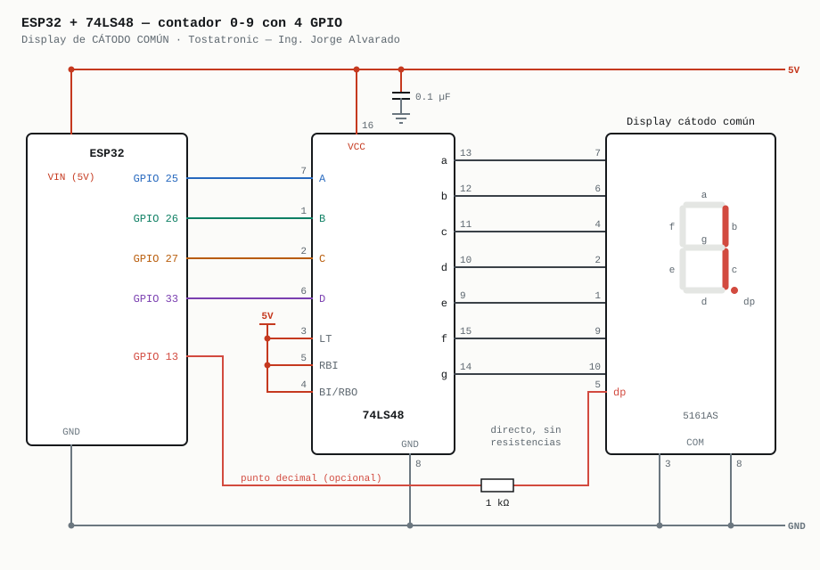
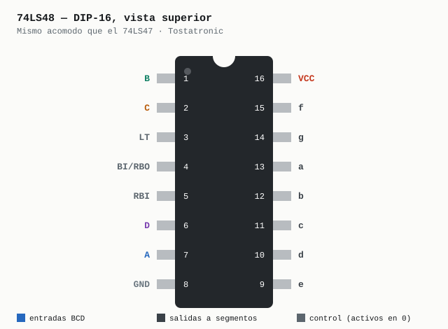
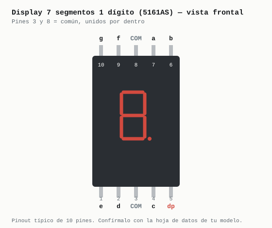

# Contador 0–9 — ESP32 + 74LS48 + display de 7 segmentos

Proyecto demostrativo de **Tostatronic** — Ing. Jorge Alvarado.

Maneja un display de 7 segmentos de **cátodo común** usando **solo 4 GPIO**, con el
decodificador BCD **74LS48**. El ESP32 manda el número en binario; el 74LS48 decide
qué segmentos encender.

Cuenta de 0 a 9 con un punto decimal que parpadea, sin un solo `delay()` en el
`loop()`, y desde el monitor serie puedes mostrar el número que quieras.

---

## 1. ¿Cuál sketch abro?

Hay **un sketch por placa**, porque los pines no son los mismos. La lógica es idéntica.

| Tu placa | Abre este sketch | Placa en el IDE |
|---|---|---|
| **ESP32 clásico**: WROOM-32, DevKit V1, NodeMCU-32S | `ESP32_Contador_74LS48/` | *ESP32 Dev Module* |
| **ESP32-S3**: DevKitC-1 y similares | `ESP32S3_Contador_74LS48/` | *ESP32S3 Dev Module* |

Si eliges la placa equivocada en el Arduino IDE, el sketch **no compila**: cada uno
verifica el chip con un `#error` que te dice cuál abrir.

---

## 2. Esquemático de conexión

El cableado del 74LS48 y del display es **idéntico en las dos placas**. Solo cambian
los GPIO.

### ESP32 clásico



| ESP32 | 74LS48 | Señal | Para qué |
|---|---|---|---|
| **GPIO 25** | pin 7 — A | bit 0 | El bit de menor peso (vale 1) |
| **GPIO 26** | pin 1 — B | bit 1 | Vale 2 |
| **GPIO 27** | pin 2 — C | bit 2 | Vale 4 |
| **GPIO 33** | pin 6 — D | bit 3 | El de mayor peso (vale 8) |
| VIN (5 V) | pin 16 — VCC | +5 V | Alimentación del chip |
| — | pin 3 — LT | +5 V | Prueba de lámpara, activo en 0: arriba nunca se activa |
| — | pin 5 — RBI | +5 V | Apagado del cero, activo en 0 |
| — | pin 4 — BI/RBO | +5 V | Apagado total, activo en 0 |
| GND | pin 8 — GND | 0 V | **Tierra común** con el ESP32 |
| **GPIO 13** | — | punto decimal | Opcional: con 1 kΩ al pin 5 del display |

Los GPIO 33, 25, 26 y 27 están **seguidos en el header** del DevKit: cuatro jumpers en fila.

### ESP32-S3


| ESP32-S3 | 74LS48 | Señal |
|---|---|---|
| **GPIO 4** | pin 7 — A | bit 0 |
| **GPIO 5** | pin 1 — B | bit 1 |
| **GPIO 6** | pin 2 — C | bit 2 |
| **GPIO 7** | pin 6 — D | bit 3 |
| 5V | pin 16 — VCC | +5 V |
| **GPIO 15** | — | punto decimal (opcional, con 1 kΩ) |

LT, RBI, BI/RBO y GND se conectan igual que en el clásico.

> ### ⚠️ El ESP32-S3 no tiene GPIO 25
>
> El S3 salta de GPIO 21 a GPIO 26: **22, 23, 24 y 25 no existen**. Si usas los pines
> del clásico, el sketch compila, la placa arranca… y el display no hace nada.
> Los GPIO 4 a 7 y 15 están seguidos en el DevKitC-1 y ninguno es de strapping
> (0, 3, 45 y 46).

### Del 74LS48 al display

| 74LS48 | Segmento | Display (5161AS) |
|---|---|---|
| pin 13 | a | pin 7 |
| pin 12 | b | pin 6 |
| pin 11 | c | pin 4 |
| pin 10 | d | pin 2 |
| pin 9 | e | pin 1 |
| pin 15 | f | pin 9 |
| pin 14 | g | pin 10 |
| — | común | **pines 3 y 8 → GND** |

**Directo, sin resistencias.** La razón está en la sección 5.

> **Capacitor de 0.1 µF cerámico entre el pin 16 y el pin 8, pegado al chip.**
> Los chips TTL generan picos de corriente al cambiar; sin él puedes ver números
> que parpadean o se "brincan".

---

## 3. Pinouts

### 74LS48 — como lo verás en el protoboard, con la muesca hacia arriba



> **Las entradas no están en orden.** A es el pin 7, B el 1, C el 2 y D el 6.
> Es el error de cableado más común: conectar A–D a los pines 1–4 en orden.

### Display de 1 dígito



> El pinout de 10 pines es el más común, pero **no es universal**. Si tu display es
> de otro modelo, revisa su hoja de datos o identifica los pines con el multímetro en
> modo diodo.

---

## 4. ¿Un chip de 5 V con un ESP32 de 3.3 V?

Sí, y aquí no hace falta nada extra. Es justo lo contrario del proyecto del 74HC595.

El 74LS48 es de la familia **TTL (LS)**: se alimenta con **5 V** (de 4.75 a 5.25 V),
pero sus entradas reconocen un "1" desde **2.0 V**. Los 3.3 V del ESP32 están
cómodamente por arriba.

| | Mínimo para leer un "1" | El ESP32 entrega | ¿Funciona? |
|---|---|---|---|
| **74LS48 @ 5 V** | **2.0 V** | 3.3 V | ✅ Sí, directo |
| 74HC595 @ 5 V *(otro proyecto)* | 3.5 V | 3.3 V | ❌ Fuera de especificación |

Además, **ningún pin del ESP32 ve 5 V**: las salidas del 74LS48 van al display, no
regresan al microcontrolador. Lo único obligatorio es la **tierra común**.

> **No lo alimentes con 3.3 V.** Un chip LS necesita 5 V para funcionar bien.

---

## 5. Por qué el 74LS48 y por qué sin resistencias

**74LS48 = cátodo común.** Sus salidas son activas en **ALTO**: para encender un
segmento, la salida va a 1 y empuja corriente hacia el display, cuyo común está a
tierra.

**74LS47 = ánodo común.** Mismos pines, lógica al revés: salidas activas en **BAJO**
(colector abierto) que absorben la corriente de un display con el común a +5 V.

| Si conectas… | Lo que pasa |
|---|---|
| 74LS48 + cátodo común | ✅ Funciona |
| 74LS47 + ánodo común (con resistencias de 330 Ω) | ✅ Funciona |
| 74LS47 + cátodo común | Nada enciende: el 47 no puede entregar corriente |
| 74LS48 + ánodo común | El número sale **en negativo**: prende lo que debería estar apagado |

**Sin resistencias:** cada salida del 74LS48 tiene una **resistencia pull-up interna
de ~2 kΩ**, que ya limita la corriente del segmento a ~1.5 mA. Por eso los segmentos
van directo.

**La consecuencia es el brillo:** con ~1.5 mA el display se ve bien en interiores,
pero tenue a plena luz. Si necesitas más brillo, usa un **CD4511**: es el equivalente
CMOS para cátodo común y entrega mucha más corriente. En ese caso sí lleva una
resistencia por segmento.

**El punto decimal** no pasa por el decodificador. Va directo del ESP32 con una
resistencia de **1 kΩ**, que da una corriente parecida a la de los segmentos y hace
que brille igual que ellos.

---

## 6. Los pines de control

Los tres son **activos en bajo**: se activan con 0. Para uso normal van a +5 V.

| Pin | Nombre | Si lo pones en 0 |
|---|---|---|
| 3 | **LT** (Lamp Test) | Enciende todos los segmentos. Sirve para probar el display |
| 4 | **BI/RBO** | Apaga todo el display |
| 5 | **RBI** | Si el número es 0, no lo muestra (para quitar ceros a la izquierda) |

Conectar BI/RBO directo a +5 V es seguro **porque RBI también está en 1**. Si algún
día usas RBI para apagar ceros en cascada, BI/RBO pasa a ser una salida y ya no debe
ir amarrado a +5 V.

---

## 7. Cómo está hecho el código

Todo el trabajo de mostrar un número es **una función de 3 líneas**:

```cpp
void mostrar(uint8_t n) {
  for (uint8_t bit = 0; bit < 4; bit++) {
    digitalWrite(PINES_BCD[bit], (n >> bit) & 1);
  }
}
```

El número se descompone en sus 4 bits y cada bit va a su pin. El 74LS48 hace el
resto: esa es la ventaja del decodificador frente a manejar 7 segmentos a mano.

- **Sin `delay()` en el `loop()`:** el contador y el parpadeo del punto avanzan con
  `millis()`, así que el procesador queda libre para WiFi, botones o sensores.
- **Apagar sin pines extra:** `mostrar(15)`. En el 74LS48, el código 1111 deja todos
  los segmentos apagados.
- **Prueba al arrancar:** muestra un **8.** durante medio segundo. Si falta un
  segmento, sabes que es cableado y no código.

### Monitor serie (115200 baudios)

| Escribes | Qué hace |
|---|---|
| `0` … `9` | Muestra ese número y pausa el contador |
| `c` | Continúa contando |
| `x` | Apaga el display |

Mientras cuenta, imprime el número y sus bits: `5  (D C B A = 0 1 0 1)`.

### Detalles del 74LS48 que te vas a encontrar

- **El 6 y el 9 salen sin "colita":** el 6 no enciende el segmento *a* y el 9 no
  enciende el *d*. Es el diseño del chip, no un error de cableado.
- **Del 10 al 14** salen símbolos raros, y el **15** apaga todo.

---

## 8. Lista de materiales

| Cant. | Componente |
|---|---|
| 1 | ESP32 DevKit **o** ESP32-S3 DevKitC-1 |
| 1 | 74LS48 (DIP-16) |
| 1 | Display de 7 segmentos de **cátodo común**, 1 dígito (p. ej. 5161AS) |
| 1 | Resistencia 1 kΩ ¼ W (solo si usas el punto decimal) |
| 1 | Capacitor cerámico 0.1 µF |
| 1 | Protoboard y jumpers |

---

## 9. Cargar y probar

1. Abre en el Arduino IDE el `.ino` que corresponde a tu placa (sección 1).
2. Selecciona la placa correcta en *Herramientas → Placa*.
3. Carga y abre el **monitor serie a 115200 baudios**.

Al arrancar verás un **8.** y luego empezará a contar.

> **Monitor serie en el ESP32-S3:** si tu placa solo tiene el USB nativo, activa
> *Herramientas → USB CDC On Boot → Enabled* **antes** de cargar.

### Si algo no sale

| Síntoma | Causa más probable |
|---|---|
| No enciende nada, ni el 8 del arranque | Display de ánodo común, común sin conectar a GND o el 74LS48 sin 5 V |
| El número sale "en negativo" | Es un display de **ánodo común**: usa un 74LS47 |
| Números equivocados (p. ej. 1 en vez de 2) | Entradas A–D en desorden: A es el pin 7, no el 1 |
| Falta un segmento en todos los números | Ese segmento está mal cableado entre el 48 y el display |
| Todo apagado aunque el serie sí cuenta | BI/RBO (pin 4) en 0 o conectado a GND |
| Siempre muestra un 8, no cuenta | LT (pin 3) en 0: debe ir a +5 V |
| El 0 no aparece, los demás sí | RBI (pin 5) en 0: debe ir a +5 V |
| El display se ve muy tenue | Normal en el 74LS48 (~1.5 mA). Para más brillo usa un CD4511 |
| Números que parpadean o se brincan | Falta el capacitor de 0.1 µF, o no hay tierra común |

---

## Estructura

```
Contador_74LS48/
├── README.md
├── ESP32_Contador_74LS48/     ← sketch para ESP32 clásico
├── ESP32S3_Contador_74LS48/   ← sketch para ESP32-S3
└── docs/                      ← esquemáticos y pinouts (SVG y PNG)
```

---

**Desarrollado por Tostatronic** — Ing. Jorge Alvarado
[tostatronic.com](https://www.tostatronic.com) · Guadalajara, Jalisco
