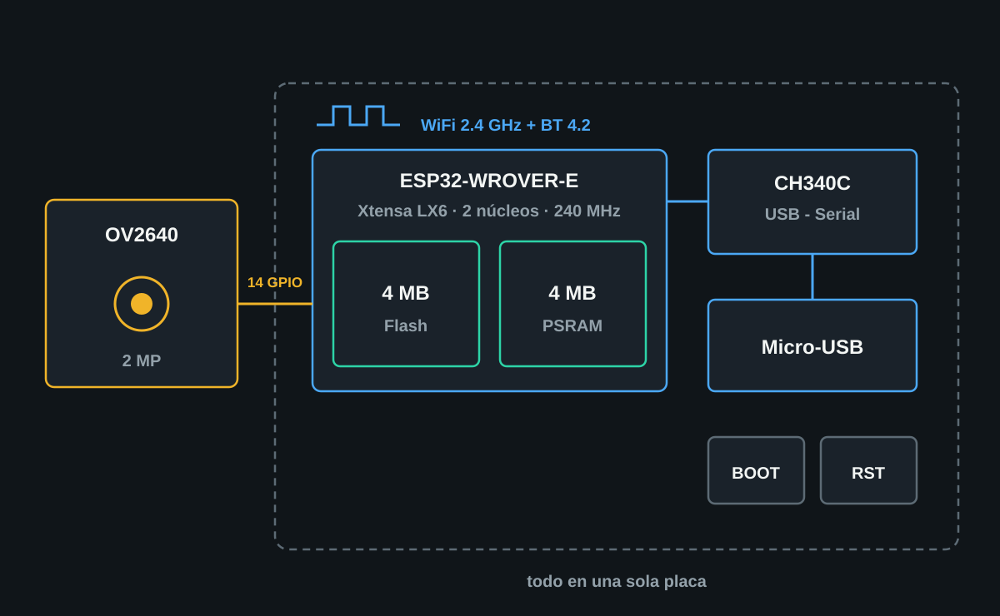
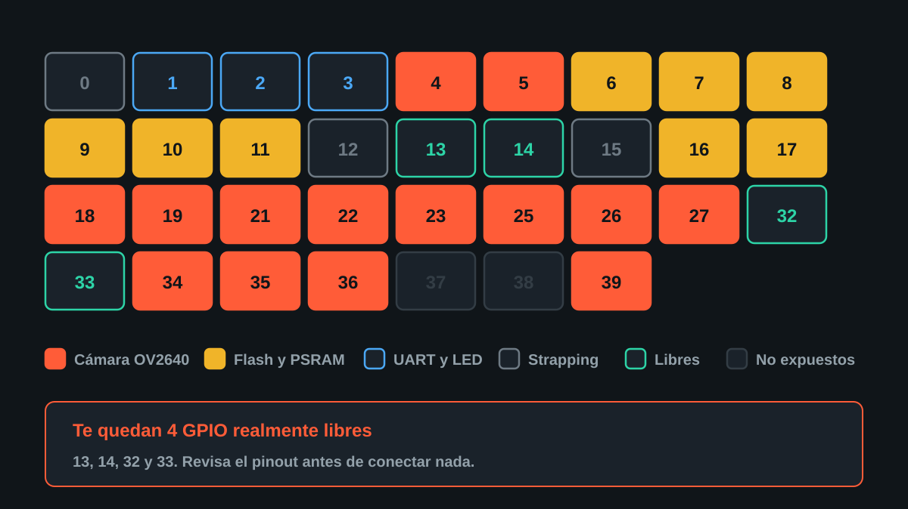

# ESP32-WROVER-CAM + OV2640

Proyecto demostrativo de **Tostatronic** — Ing. Jorge Alvarado.

Placa ESP32-WROVER-CAM con cámara OV2640 de 2 MP: captura, procesamiento y
transmisión de imágenes por WiFi, programable directo por Micro-USB sin
programador externo.

---



## Por qué esta placa

La diferencia práctica frente a una ESP32-CAM clásica está en dos cosas:

1. **Convertidor CH340C integrado.** Se conecta y se programa directo por
   Micro-USB. No necesitas FTDI, ni adaptador USB-TTL, ni puentear GPIO0 a GND
   cada vez que quieres cargar un sketch.
2. **4 MB de PSRAM.** El buffer de imagen vive ahí, así que puedes trabajar con
   la resolución completa del sensor en lugar de quedarte limitado por la RAM
   interna del ESP32.

---

## Características

| | |
|---|---|
| Módulo | ESP32-WROVER-E |
| Arquitectura | Xtensa LX6 de 32 bits, doble núcleo |
| Frecuencia máxima | 240 MHz |
| Flash | 4 MB |
| PSRAM | 4 MB |
| Cámara | OV2640, ~2 MP |
| WiFi | IEEE 802.11 b/g/n — 2.4 GHz |
| Bluetooth | 4.2 BR/EDR + BLE |
| USB-Serial | CH340C |
| Conector | Micro-USB |
| Antena | Integrada en PCB |
| Botones | BOOT y RESET |
| LED de usuario | GPIO2 |
| Programación | Arduino IDE y ESP-IDF |

Periféricos disponibles según los GPIO libres: GPIO digital, ADC, DAC, PWM,
UART, SPI, I2C, I2S, sensores táctiles capacitivos y contadores de pulsos.

---

## Conexión de la cámara OV2640

Estos GPIO **los usa la cámara internamente** mientras está activa:

| Señal OV2640 | GPIO |
|---|---:|
| XCLK | 21 |
| SIOD / SDA | 26 |
| SIOC / SCL | 27 |
| Y9 | 35 |
| Y8 | 34 |
| Y7 | 39 |
| Y6 | 36 |
| Y5 | 19 |
| Y4 | 18 |
| Y3 | 5 |
| Y2 | 4 |
| VSYNC | 25 |
| HREF | 23 |
| PCLK | 22 |



> **Revisa el pinout antes de conectar cualquier cosa.** Son 14 GPIO ocupados.
> Si conectas un sensor, una pantalla o un relé sobre alguno de ellos, la cámara
> deja de funcionar — o el periférico nunca responde. Es el error más común al
> montar un proyecto sobre esta placa.
>
> Ojo también con GPIO 34, 35, 36 y 39: en el ESP32 son **solo de entrada**, no
> tienen resistencias de pull-up internas y no sirven como salida.

---

## Aplicaciones

Cámaras WiFi · videovigilancia · monitoreo remoto · timbres inteligentes ·
domótica · robots con visión · captura periódica de fotografías · streaming por
servidor web · lectura y procesamiento básico de imágenes · proyectos
educativos de visión e IoT · sistemas de acceso.

---

## Contenido del kit

- 1 × Placa ESP32-WROVER-CAM / ESP32-WROVER-DEV
- 1 × Cámara OV2640 de 2 MP

El cable USB, sensores y demás accesorios se venden por separado salvo que se
indique lo contrario.

---

## Demo: cámara WiFi con portal cautivo

Sketch: [`ESP32_WROVER_CAM_Portal/`](ESP32_WROVER_CAM_Portal/ESP32_WROVER_CAM_Portal.ino)

Ninguna clave de WiFi va escrita en el código. La placa se configura desde el
teléfono y después sirve el video de la cámara en una página web.

### Cómo se usa

1. **Carga el sketch.** Arduino IDE → placa **ESP32 Wrover Module** → Partition
   Scheme **Huge APP (3MB No OTA)**. No hay que instalar librerías: todo viene
   en el core `esp32` de Espressif (3.x).
2. **Conéctate a la red `Tostatronic-CAM`** desde el teléfono. El portal cautivo
   se abre solo (si no, entra a `http://192.168.4.1`).
3. **Elige tu red** de la lista escaneada, escribe la clave y pulsa *Conectar*.
   La página te muestra la IP que recibió la cámara; la placa se reinicia ya
   enlazada a tu WiFi.
4. **Abre esa IP** (o `http://tostacam.local`) desde tu WiFi y pulsa
   **Iniciar captura**.

La página de la cámara también permite tomar una foto, cambiar la resolución en
caliente (de QVGA hasta UXGA 1600×1200, gracias a la PSRAM) y muestra cuadros
por segundo, señal WiFi y PSRAM libre.

### Volver al portal

- Botón **Olvidar esta red WiFi** al pie de la página, o
- dejar presionado **BOOT** durante 3 segundos.

Si la red guardada no responde al arrancar (clave cambiada, router apagado), la
placa abre el portal sola y reintenta cada 3 minutos mientras nadie lo use.

### LED de usuario (GPIO2)

| Parpadeo | Significado |
|---|---|
| Lento (0.5 s) | Portal abierto, esperando configuración |
| Rápido | Conectándose al WiFi |
| Muy rápido, permanente | La cámara no inició: revisa el cable flex |
| Encendido fijo | Cámara en línea |

### Rutas HTTP

| Ruta | Puerto | Qué hace |
|---|---:|---|
| `/` | 80 | Página con el visor |
| `/stream` | 81 | Video MJPEG |
| `/foto` | 80 | Una foto JPEG |
| `/estado` | 80 | JSON: FPS, resolución, RSSI, PSRAM |
| `/resolucion?val=vga` | 80 | `qvga` · `vga` · `svga` · `xga` · `uxga` |
| `/olvidar` (POST) | 80 | Borra el WiFi y reinicia al portal |

El stream va en su propio puerto porque un MJPEG es una respuesta HTTP que
nunca termina: en el mismo servidor, mientras hay video no respondería ningún
botón. El stream atiende **un espectador a la vez**.

> **Seguridad.** Es un demo: el portal es una red abierta (la clave de tu WiFi
> viaja sin cifrar durante la configuración) y la página de la cámara no pide
> contraseña. Para algo permanente, pon una clave en `AP_CLAVE` y no expongas
> la placa a internet.

---

## Estructura de este repositorio

```
ESP32_WROVER_CAM/
├── README.md
├── ESP32_WROVER_CAM_Portal/   ← sketch: portal cautivo + visor de video
│   ├── ESP32_WROVER_CAM_Portal.ino
│   └── paginas.h              ← las dos páginas web (HTML/CSS/JS embebido)
├── presentacion/              ← material de difusión (Instagram 1:1 y horizontal 16:9)
└── docs/                      ← diagramas
```

---

**Desarrollado por Tostatronic** — Ing. Jorge Alvarado
[tostatronic.com](https://www.tostatronic.com) · Guadalajara, Jalisco
