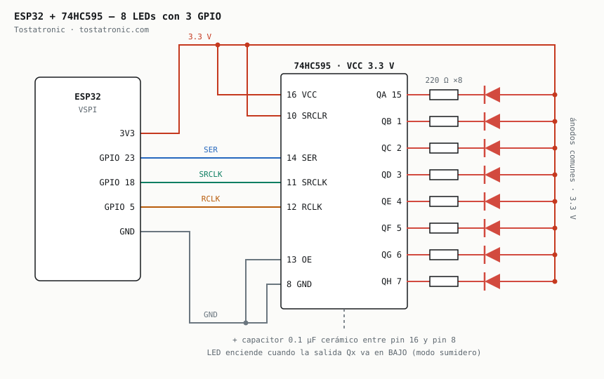
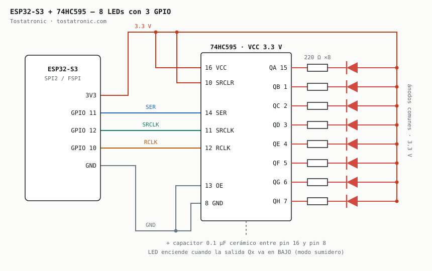
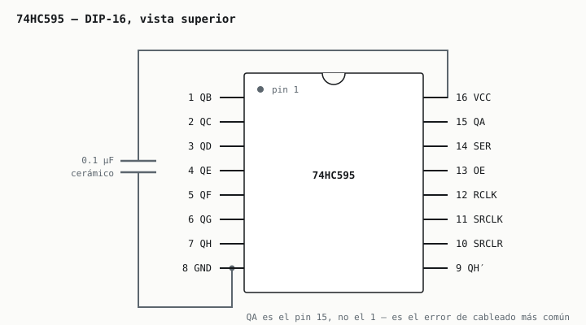
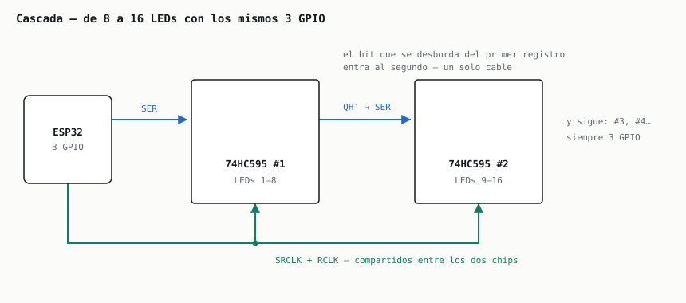

# Recorrido de LEDs — ESP32 + 74HC595

Proyecto demostrativo de **Tostatronic**. Controla 8 LEDs — ampliables a 16, 24 o 32 —
usando **solo 3 GPIO**, mediante un registro de desplazamiento 74HC595.

Seis patrones encadenados, sin un solo `delay()` en el código.

---

## 1. ¿Cuál sketch abro?

Hay **un sketch por placa**, porque los pines no son los mismos. La lógica es idéntica;
lo único que cambia son los tres GPIO.

| Tu placa | Abre este sketch | Placa en el IDE |
|---|---|---|
| **ESP32 clásico** — WROOM-32, DevKit V1, NodeMCU-32S | `ESP32_Recorrido_LEDs_595/` | *ESP32 Dev Module* |
| **ESP32-S3** — DevKitC-1 y similares | `ESP32S3_Recorrido_LEDs_595/` | *ESP32S3 Dev Module* |

Si eliges la placa equivocada en el Arduino IDE, el sketch **no compila**: cada uno
verifica el chip con un `#error` que te dice cuál abrir. Es a propósito — es mucho
mejor un error de compilación que un circuito que carga bien y no hace nada.

---

## 2. Esquemático de conexión

El cableado del 74HC595 es **idéntico en las dos placas**. Lo único que cambia son los
tres GPIO que salen del microcontrolador.

### ESP32 clásico



| ESP32 | 74HC595 | Señal | Para qué |
|---|---|---|---|
| **GPIO 23** | pin 14 — SER | datos | El bit que entra al registro |
| **GPIO 18** | pin 11 — SRCLK | reloj | Cada flanco recorre los bits una posición |
| **GPIO 5** | pin 12 — RCLK | latch | Vuelca el registro a las salidas, de golpe |
| 3V3 | pin 16 — VCC | +3.3 V | Alimentación del chip |
| 3V3 | pin 10 — SRCLR | +3.3 V | Activo en bajo: amarrado arriba nunca borra |
| GND | pin 13 — OE | 0 V | Activo en bajo: salidas siempre habilitadas |
| GND | pin 8 — GND | 0 V | Tierra común |
| — | pins 15, 1–7 — QA…QH | salidas | Cada una a su R de 220 Ω y su LED |
| — | pin 9 — QH′ | cascada | Al SER del siguiente 595 |

Los GPIO 23, 18 y 5 son **MOSI, SCK y SS del bus VSPI**.

### ESP32-S3



| ESP32-S3 | 74HC595 | Señal | Para qué |
|---|---|---|---|
| **GPIO 11** | pin 14 — SER | datos | El bit que entra al registro |
| **GPIO 12** | pin 11 — SRCLK | reloj | Cada flanco recorre los bits una posición |
| **GPIO 10** | pin 12 — RCLK | latch | Vuelca el registro a las salidas, de golpe |
| 3V3 | pin 16 — VCC | +3.3 V | Alimentación del chip |
| 3V3 | pin 10 — SRCLR | +3.3 V | Activo en bajo: amarrado arriba nunca borra |
| GND | pin 13 — OE | 0 V | Activo en bajo: salidas siempre habilitadas |
| GND | pin 8 — GND | 0 V | Tierra común |
| — | pins 15, 1–7 — QA…QH | salidas | Cada una a su R de 220 Ω y su LED |
| — | pin 9 — QH′ | cascada | Al SER del siguiente 595 |

Los GPIO 11, 12 y 10 son **MOSI, SCK y SS del bus SPI2 / FSPI**.

> ### ⚠️ El ESP32-S3 no tiene GPIO 23
>
> El S3 tiene un hueco en la numeración: existen **GPIO 0–21 y 26–48**, pero
> **22, 23, 24 y 25 no existen**. Los pines típicos de los tutoriales del ESP32
> clásico (23, 18, 5) no sirven aquí.
>
> Lo peligroso es que **no falla ruidosamente**: `pinMode(23, OUTPUT)` sobre un pin
> inexistente no da error, simplemente se ignora. El sketch compila, la placa arranca,
> el monitor serie imprime los patrones — y los LEDs no hacen absolutamente nada.
> La mayoría de la gente pierde una hora revisando el cableado.
>
> **Si mueves los pines en el S3, evita también:**
>
> | GPIO | Por qué |
> |---|---|
> | 0, 3, 45, 46 | Strapping — definen el modo de arranque |
> | 19, 20 | USB nativo |
> | 26–32 | Flash y PSRAM internos |
> | 33–37 | Ocupados en módulos con memoria octal (N8R8, N16R8) |

---

## 3. Pinout del 74HC595

El esquemático de arriba acomoda los pines por función. Este es el chip **como lo vas a
ver en el protoboard**, con la muesca hacia arriba.



> **QA es el pin 15, no el 1.** Es el error de cableado más común con este chip: uno
> asume que QA…QH van del 1 al 8, y en realidad son **15, 1, 2, 3, 4, 5, 6, 7**.

> **Capacitor de 0.1 µF cerámico entre pin 16 y pin 8, lo más pegado posible al chip.**
> No es opcional. Sin él aparecen glitches en el latch y vas a ver LEDs parpadeando
> donde no deben — un bug que se ve exactamente igual que un error de código.

---

## 4. Por qué el 595 va a 3.3 V y no a 5 V

Este es el punto técnico que decide si el circuito es confiable o si "a veces jala".

El ESP32 —clásico y S3— entrega **3.3 V** en sus GPIO. Un **74HC595 alimentado a 5 V**
exige `VIH = 0.7 × VCC = 3.5 V` para reconocer un nivel alto. **3.3 V queda por debajo**,
así que el circuito opera fuera de especificación: puede funcionar en la mesa y fallar
al calentar, o meter bits basura en el registro.

**Solución usada en este proyecto:** alimentar el 74HC595 con **3.3 V** desde el pin
`3V3` del ESP32. El HC595 trabaja de 2 V a 6 V, y a 3.3 V su `VIH` baja a 2.31 V —
desaparece el conflicto de niveles, sin componentes extra.

| Opción | `VIH` mínimo | ¿Sirve con ESP32? |
|---|---|---|
| 74HC595 @ 5 V | 3.5 V | ❌ Fuera de spec |
| **74HC595 @ 3.3 V** | **2.31 V** | ✅ **Recomendado** |
| 74HCT595 @ 5 V | 2.0 V | ✅ Sí — entradas TTL |
| 74LS595 @ 5 V | 2.0 V | ✅ Sí — entradas TTL |
| 74HC595 @ 5 V + level shifter | — | ✅ Sí, con 3 canales extra |

---

## 5. LEDs en modo sumidero

```
3.3V ──▶ ánodo LED ──▶ cátodo ──▶ R 220 Ω ──▶ salida Qx del 595
```

El LED enciende cuando la salida va en **BAJO**. La inversión se aplica dentro de la
función `escribir()`, así que los patrones se escriben en lógica positiva y se leen
sin voltear nada mentalmente.

**Cálculo de la resistencia**, con LED rojo (`Vf ≈ 2.0 V`) y `VOL ≈ 0.3 V`:

```
(3.3 V − 2.0 V − 0.3 V) / 5 mA = 200 Ω  →  comercial: 220 Ω  →  ~4.5 mA por LED
```

Ocho LEDs son 36 mA en total, muy por debajo del límite del chip.

Para modo fuente —ánodo a la salida, cátodo a GND— cambia `MODO_SUMIDERO` a `false`.

> **LEDs azules o blancos:** su `Vf` sube a ~3.0 V y a 3.3 V casi no queda margen.
> Para esos conviene el **74HCT595 a 5 V**, que además acepta los 3.3 V del ESP32.

---

## 6. Cascada: de 8 a 16 LEDs



1. Conecta el **pin 9 (QH′)** del primer 595 al **pin 14 (SER)** del segundo.
2. Comparte `SRCLK` y `RCLK` entre ambos chips.
3. En el sketch, cambia `NUM_REGISTROS` de `1` a `2`.

Los patrones se recalculan solos. Siguen siendo **los mismos 3 GPIO** — ese es todo el
punto del chip.

El máximo es `NUM_REGISTROS = 4` (32 LEDs), porque el patrón viaja en un `uint32_t`.
El sketch lo valida con un `static_assert`, así que pasarse da error de compilación en
vez de LEDs truncados en silencio.

---

## 7. Cómo está hecho el código

**No usa `delay()`.** Cada patrón es una función pura que recibe el número de paso y
devuelve qué LEDs deben estar encendidos en ese instante:

```cpp
uint32_t patronRecorrido(uint16_t paso) {
  return 1UL << paso;
}
```

El avance lo lleva `millis()` en el `loop()`, así que el procesador queda libre para
agregarle WiFi, botones o sensores en proyectos posteriores.

**Patrones incluidos:** recorrido, ping-pong (Knight Rider), llenado, vaciado,
encuentro y contador binario. Cada uno se declara en una tabla con sus pasos, su
intervalo y sus repeticiones:

```cpp
Patron secuencia[] = {
  { "Recorrido",  patronRecorrido, NUM_LEDS,          80, 2 },
  { "Ping-pong",  patronPingPong,  2 * NUM_LEDS - 2,  70, 3 },
  // ...
};
```

Agregar un patrón nuevo es escribir una función y añadir un renglón a esa tabla.

> **Nota de mantenimiento:** los dos sketches comparten ~140 líneas idénticas. Es
> deliberado — así cada carpeta se descarga y funciona sola, sin instalar librerías,
> que es lo que necesita un tutorial. El costo es que **un patrón nuevo hay que
> agregarlo en los dos archivos**, o se van a desincronizar.

---

## 8. Lista de materiales

| Cant. | Componente |
|---|---|
| 1 | ESP32 DevKit **o** ESP32-S3 DevKitC-1 |
| 1 | 74HC595 (DIP-16) |
| 8 | LED 5 mm |
| 8 | Resistencia 220 Ω ¼ W |
| 1 | Capacitor cerámico 0.1 µF |
| 1 | Protoboard y jumpers |

Para la versión de 16 LEDs: un 74HC595 más, 8 LEDs más, 8 resistencias más y otro
capacitor de 0.1 µF.

---

## 9. Cargar y probar

1. Abre en el Arduino IDE el `.ino` que corresponde a tu placa (sección 1).
2. Selecciona la placa correcta en *Herramientas → Placa*.
3. Carga y abre el **monitor serie a 115200 baudios**: va indicando qué patrón se
   está reproduciendo.

> **Monitor serie en el ESP32-S3:** si tu placa tiene dos puertos USB, usa el marcado
> `UART` / `COM`. Si solo tiene el USB nativo, activa
> *Herramientas → USB CDC On Boot → Enabled* **antes** de cargar, o no vas a ver nada
> en el monitor.

### Si no enciende ningún LED

| Síntoma | Causa más probable |
|---|---|
| Nada, pero el monitor serie sí imprime | Pines equivocados, o QA cableado al pin 1 en vez del 15 |
| Todos encendidos y fijos | `MODO_SUMIDERO` no corresponde a cómo cableaste los LEDs |
| Patrones correctos pero con parpadeos raros | Falta el capacitor de 0.1 µF, o está lejos del chip |
| Funciona y luego falla al calentar | El 595 está a 5 V — pásalo a 3.3 V (sección 4) |

---

## Diagrama interactivo

El archivo [`diagrama-conexion.html`](diagrama-conexion.html) trae los mismos
esquemáticos en una página que puedes abrir en el navegador, con tema claro y oscuro.

---

**Tostatronic** — [tostatronic.com](https://www.tostatronic.com)
