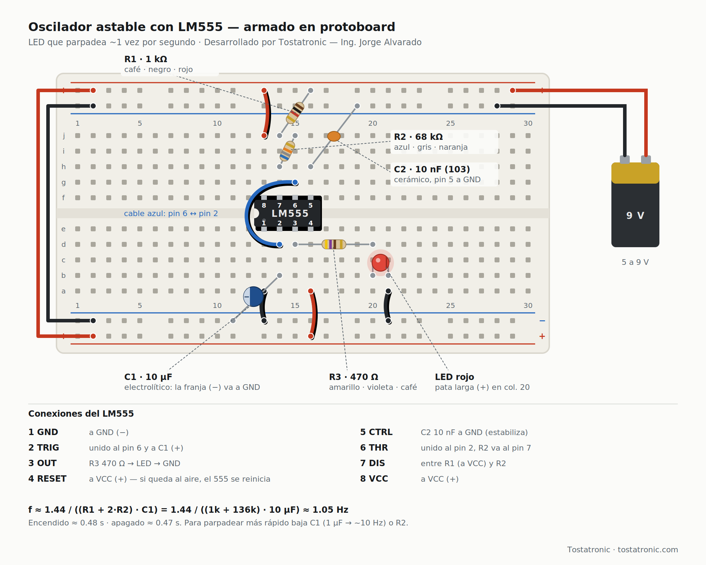
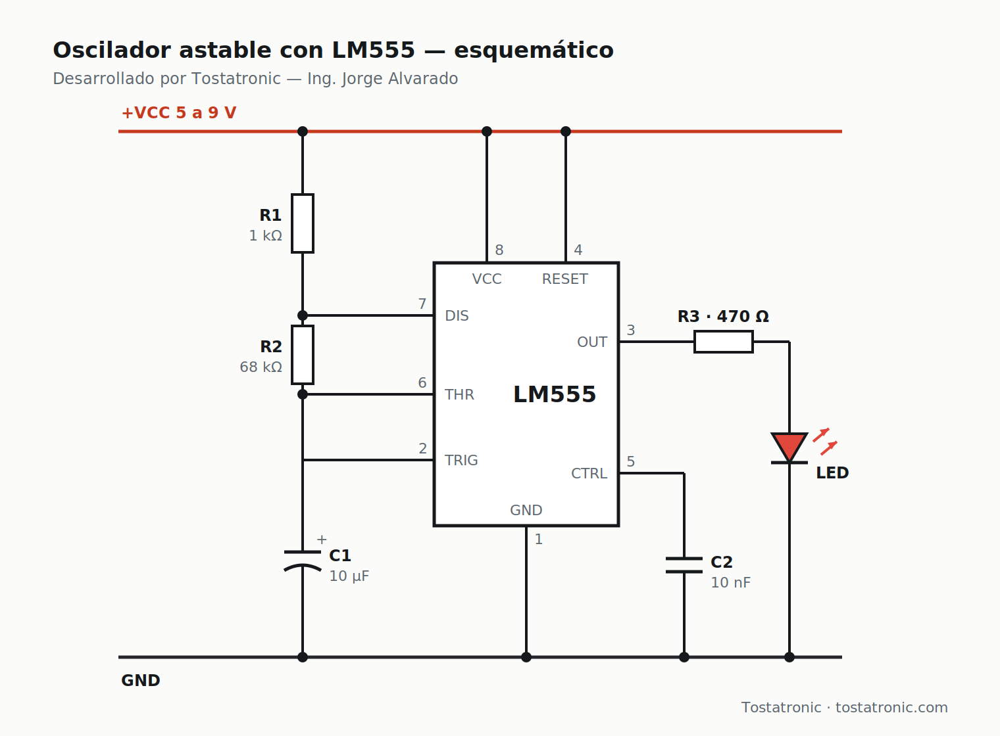
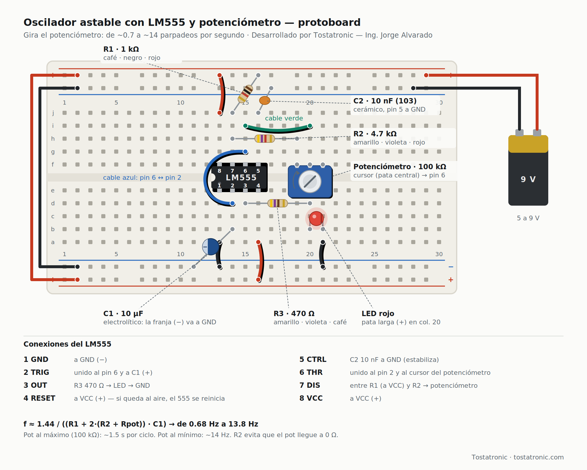
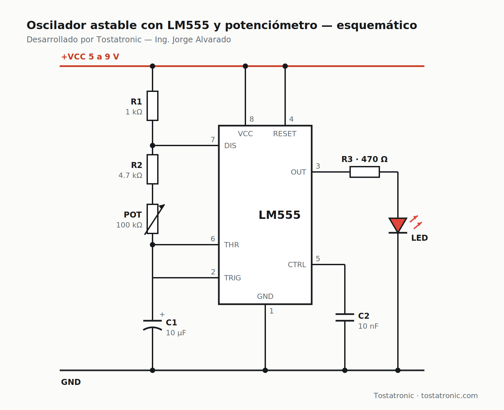

# Timer LM555 — oscilador astable

Proyecto demostrativo de **Tostatronic** — Ing. Jorge Alvarado.

El LM555 es un temporizador de 8 pines diseñado en 1971 que sigue en miles de
circuitos. Aquí lo usamos en su modo más clásico: un **oscilador astable** que
hace parpadear un LED sin programar nada, solo con resistencias y un capacitor.

Hay dos versiones:

| Versión | Qué hace |
|---|---|
| **Fija** | El LED parpadea ~1 vez por segundo |
| **Con potenciómetro** | Giras la perilla y el parpadeo va de ~0.7 a ~14 veces por segundo |

---

## Cómo funciona

Por dentro, el 555 tiene tres resistencias iguales que dividen el voltaje en
tercios, dos comparadores, un flip-flop y un transistor de descarga.

En modo astable, el capacitor C1 se **carga** a través de R1 + R2 hasta ⅔ de
VCC; en ese momento el transistor interno lo **descarga** a través de R2 hasta
⅓ de VCC, y el ciclo vuelve a empezar. La salida (pin 3) queda en alto mientras
el capacitor se carga y en bajo mientras se descarga.

```
f ≈ 1.44 / ((R1 + 2·R2) · C1)
t_alto ≈ 0.693 · (R1 + R2) · C1
t_bajo ≈ 0.693 · R2 · C1
```

---

## Versión fija — ~1 Hz





| Componente | Valor | Colores / marca |
|---|---|---|
| R1 | 1 kΩ | café · negro · rojo |
| R2 | 68 kΩ | azul · gris · naranja |
| R3 | 470 Ω | amarillo · violeta · café |
| C1 | 10 µF electrolítico | la franja (−) va a GND |
| C2 | 10 nF cerámico | "103" |
| LED | rojo 5 mm | pata larga (+) hacia R3 |
| Alimentación | 5 a 9 V | batería de 9 V o fuente de protoboard |

f = 1.44 / ((1 k + 136 k) · 10 µF) ≈ **1.05 Hz** — encendido ≈ 0.48 s, apagado ≈ 0.47 s.

---

## Versión con potenciómetro — de 0.7 a 14 Hz





Cambia R2 por **R2 = 4.7 kΩ** (amarillo · violeta · rojo) **en serie con un
potenciómetro de 100 kΩ**:

- Un extremo del potenciómetro va donde termina R2.
- La **pata central (cursor)** va al pin 6.
- El otro extremo queda sin conectar.

| Potenciómetro | Frecuencia |
|---|---|
| Al máximo (100 kΩ) | ≈ 0.68 Hz (un ciclo cada ~1.5 s) |
| Al mínimo (0 Ω) | ≈ 13.8 Hz |

**R2 no se quita:** si el potenciómetro llegara a 0 Ω, el pin 7 quedaría unido
directo a los pines 6 y 2 y el 555 dejaría de oscilar bien.

---

## Conexiones del LM555

| Pin | Nombre | Conexión |
|---:|---|---|
| 1 | GND | a GND |
| 2 | TRIG | unido al pin 6 y a C1 (+) |
| 3 | OUT | R3 → LED → GND |
| 4 | RESET | a VCC |
| 5 | CTRL | C2 10 nF a GND |
| 6 | THR | unido al pin 2 |
| 7 | DIS | entre R1 y R2 |
| 8 | VCC | a VCC |

## Errores comunes

1. **Pin 4 (RESET) al aire.** El 555 se reinicia solo y parpadea raro o no enciende. Siempre a VCC.
2. **Olvidar unir el pin 6 con el pin 2.** Sin ese puente no oscila.
3. **C1 al revés.** La franja (−) del electrolítico va a GND.

---

## Datos del LM555

| | |
|---|---|
| Alimentación | 4.5 a 16 V |
| Corriente de salida | hasta 200 mA |
| Modos | astable, monoestable y biestable |
| Origen | diseñado en 1971 por Hans Camenzind para Signetics (NE555) |

---

## Estructura

```
Timer_LM555/
├── README.md
├── docs/     ← diagramas de protoboard y esquemáticos (PNG y SVG)
└── video/    ← guion, fotogramas y prompts del video con Tostabot
```

---

**Desarrollado por Tostatronic** — Ing. Jorge Alvarado
[tostatronic.com](https://www.tostatronic.com) · Guadalajara, Jalisco
